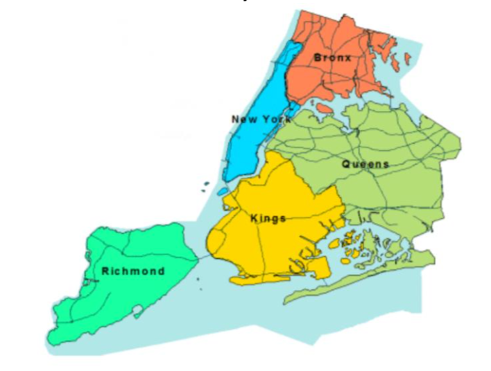

# Data Science Project
<b>NYC Census Data</b>

For this project, my team and I analyzed the census data collected of New York City.
This dataset (https://www.kaggle.com/muonneutrino/new-york-city-census-data#nyc_census_tracts.csv)
contains data from the United States Census Bureau and revised by the 2015 American Community 
Survey 5-year Estimates. Each census tract block includes demographics and economic
characteristics of nearby NYC neighborhoods. 

We used <b>Python</b> and its many libraries <b>(Numpy, Pandas, Seaborn, Matplotlib, SciPy, Plotly)</b> to run <b>exploratory 
data analysis, data cleaning, and data visualization</b> to take raw statistical data and convert
them into useful information we can use to show certain trends. At the end, we did some <b>statistical 
hypothesis testing.</b> 

These are the questions we asked and used data to answer:

<b>--Population && Demographics--</b>
- How many people reside in each county?
- Are there more males or females on average?
- Which counties have the most and least number of blocks?
- Which counties are most congested and which are the least congested? 
- Is our Population normally distributed?

<b>--Wealth and Ethnic Disparities--</b>
- What are the distribution of ethnicities per county?
- What are the disparities in median household income and income per capita per county? 
- What are the disparities of Poverty and ChildPoverty per county?
- What are some, if any, correlations regarding income?

<b>--Indicators of Wealth--</b>
- What are the mean and total values of job types worked for each county?
- What are the mean and total values of "commuting means" taken for each county?
- Is there any a correlation between Income and the "MeanCommute" time to work?

<b>--Hypothesis Testing--</b>
- Do the proportions of work category also have a significant correlation with the county's social economic status? 
In other words, will these categories show more "private" employees in New York versus more "public" employees in the Bronx?

# Tools used
Python, Jupyter Notebook, Numpy, Pandas, Seaborn, Matplotlib, SciPy, Plotly
